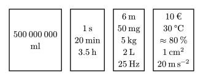
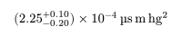

A thin, opinionated wrapper around [`zero`](https://typst.app/universe/package/zero), providing some functionality from the now unmaintained [`metro`](https://typst.app/universe/package/metro) package that I miss; because `zero.zi` wasn't quite what I needed for my documents (that is a great alternative for when this package starts to fall apart though).

Made for stuff like this:
```typ
#import "@local/null:0.1.0": *
#table(columns: 4, align: center+horizon, gutter: 1em,
  [
    #value(group: (size: 3), 500000000)\
    #qty("milli litre")
  ],
  [
    #unit(1, "second")\
    #unit(20, "minute")\
    #unit(3.5, "hour")
  ],
  [
    #unit(6, "metre")\
    #unit(50, "milli gram")\
    #unit(5, "kilo gramme")\
    #unit(2, "liter")\
    #unit(25, "hertz")\
  ],
  [
    #unit(10, "euro")\
    #unit(30, "degree celsius")\
    $approx unit(80, "percent")$\
    #unit(1, "centi meter squared")\
    #unit(20, "meter second reciprocal-squared")
  ],
)
```



But, thanks to zero, we can also do this:
```typ
#unit("2.25+.1-.2e-4", "micro second metre hecto gram squared")
```


