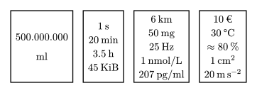
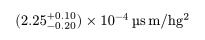

A thin, opinionated wrapper around [`zero`](https://typst.app/universe/package/zero), providing some functionality from the now unmaintained [`metro`](https://typst.app/universe/package/metro) package that I miss; because `zero.zi` wasn't quite what I needed for my documents (that is a great alternative for when this package starts to fall apart though).

> [!NOTE]
> As of [v0.7.0](https://github.com/Mc-Zen/zero/releases/tag/v0.7.0) (August 12, 2026), `zero` has native support for writing quantities in-place with `quan`. This makes a good chunk of this package obsolete, but some may still prefer `null`'s syntax or have the need to globally define units that can be used in composition.

---

Made for stuff like this:
```typ
#import "@local/null:0.1.0": *
#table(columns: 4, align: center+horizon, gutter: 1em,
  [
    #value(group: (separator: "."), 500000000)

    #unit("milli litre")
  ],
  [
    #qty(1, "second")\
    #qty(20, "minute")\
    #qty(3.5, "hour")
  ],
  [
    #qty(6, "kilo metre")\
    #qty(50, "milli gram")\
    #qty(25, "hertz")\
    #qty(1, "nano mole per liter")\
    #qty(207, "pico gram per milli litre")\
  ],
  [
    #qty(10, "euro")\
    #qty(30, "degree celsius")\
    $approx qty(80, "percent")$\
    #qty(1, "centi meter squared")\
    #qty(20, "meter second reciprocal-squared")
  ],
)
```



But, thanks to zero, we can also do this:
```typ
#qty("2.25+.1-.2e-4", "micro second metre per hecto gram squared")
```



You may also register your own extensions; simply call `with-db(...)` to recieve your custom `unit` & `qty`!
```typ
#let (unit, qty) = with-db(db: (foo: text(red, [foo]), lorem: lorem(2)), suffixes: (buzz: $""^"buzz"$))
#qty(42, "micro foo buzz lorem")
```
